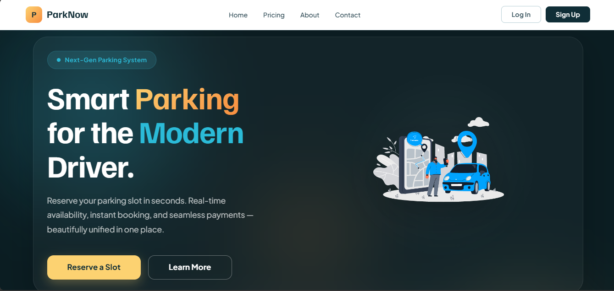

# Projects List

<table style="border-collapse: collapse; border: none; width: 100%;">
  <tr style="border: none;">
    <td valign="top" style="border: none;">
      

        <h2>1. <a href="https://github.com/Academic-Projects-SLIIT/ParkNow-Vehicle-parking-management-system.git">ParkNow</a>
      

      <ul style="margin: 0; padding-left: 20px; font-size: 14px; line-height: 1.6;">
        <li>A robust Web Application designed to streamline vehicle parking operations, slot allocation, and administrative oversight.</li>
        <li>Tech Stack: java, spring boot</li>
      </ul>
    </td>
    <td valign="top" style="border: none; width: 150px; padding-right: 15px;">
      
    </td>
  </tr>
</table>
